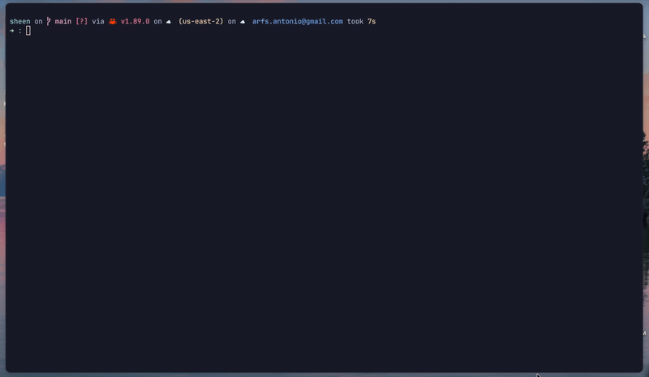

# sheen ✨

[](https://crates.io/crates/sheen)
[](https://docs.rs/sheen)

A polished, colorful logging library for Rust ✨



## Inspiration

sheen is inspired by [charmbracelet/log](https://github.com/charmbracelet/log), the excellent Go logging library. We wanted to bring the same polished experience to Rust.

## Features

- Colorful, human-readable output
- Structured key=value logging
- Multiple formatters: Text, JSON, Logfmt
- Sub-loggers with persistent fields
- TTY detection (auto-disables colors when piped)
- Builder pattern configuration
- Zero config defaults
- `log` crate compatibility (optional feature flag)
- `tracing` crate compatibility (optional feature flag)

## Installation

```toml
[dependencies]
sheen = "0.3"
```

With `log` crate support:

```toml
[dependencies]
sheen = { version = "0.3", features = ["log"] }
```

With `tracing` crate support:

```toml
[dependencies]
sheen = { version = "0.3", features = ["tracing"] }
```

## Quick Start

```rust
fn main() {
    sheen::init();

    sheen::info!("Server started", port = 3000);
    sheen::debug!("Loading config");
    sheen::warn!("Cache miss", key = "user_123");
    sheen::error!("Connection failed", attempts = 3);
}
```

Output:

```
14:32:15 INFO  Server started port=3000
14:32:15 WARN  Cache miss key="user_123"
14:32:15 ERROR Connection failed attempts=3
```

## Custom Configuration

```rust
use sheen::{Logger, Level};

fn main() {
    sheen::init_with(
        Logger::new()
            .level(Level::Trace)
            .prefix("myapp")
            .timestamp(true)
    );

    sheen::trace!("verbose output");
    sheen::info!("ready");
}
```

## Sub-loggers

Create loggers with persistent fields using `.with()`:

```rust
use sheen::{Logger, Level};

let logger = Logger::new().level(Level::Debug);
let req_log = logger.with(&[("request_id", &"abc123")]);

req_log.info("started", &[]);
req_log.info("db query", &[("table", &"users")]);
req_log.info("completed", &[("status", &200)]);
```

Output:

```
14:32:15 INFO  started request_id="abc123"
14:32:15 INFO  db query request_id="abc123" table="users"
14:32:15 INFO  completed request_id="abc123" status=200
```

## Log Crate Integration

Enable the `log` feature to use sheen as a backend for the [`log`](https://crates.io/crates/log) crate. This captures logs from any dependency that uses `log::info!()`, `log::warn!()`, etc.

```rust
use sheen::{Logger, Level};

fn main() {
    Logger::new()
        .level(Level::Debug)
        .init()
        .unwrap();

    // Standard log macros now go through sheen
    log::info!("server started");
    log::warn!("cache nearly full");
}
```

## Tracing Crate Integration

Enable the `tracing` feature to use sheen as a subscriber for the [`tracing`](https://crates.io/crates/tracing) crate. This captures events from any dependency that uses `tracing::info!()`, `tracing::warn!()`, etc.

```rust
use sheen::{Logger, Level, SheenLayer};

fn main() {
    SheenLayer::new(Logger::new().level(Level::Trace)).init();

    tracing::info!("server started");
    tracing::warn!("cache nearly full");
}
```

## Formatters

### Text (default)

Colorful, human-readable output:

```rust
let logger = Logger::new();
logger.info("hello", &[("port", &3000)]);
// 14:32:15 INFO  hello port=3000
```

### JSON

Structured output for log aggregators:

```rust
use sheen::{Logger, JsonFormatter};

let logger = Logger::new().formatter(JsonFormatter);
logger.info("hello", &[("port", &3000)]);
// {"level":"info","msg":"hello","time":"14:32:15","port":3000}
```

### Logfmt

Key=value format for Heroku, Splunk, etc:

```rust
use sheen::{Logger, LogfmtFormatter};

let logger = Logger::new().formatter(LogfmtFormatter);
logger.info("hello", &[("port", &3000)]);
// level=info msg="hello" time="14:32:15" port=3000
```

## TTY Detection

Colors are automatically disabled when output is piped:

```bash
# Colors enabled
cargo run

# Colors disabled (piped to file)
cargo run 2> logs.txt
```

Force colors on or off:

```rust
let logger = Logger::new().colorize(false);
```

## License

MIT
